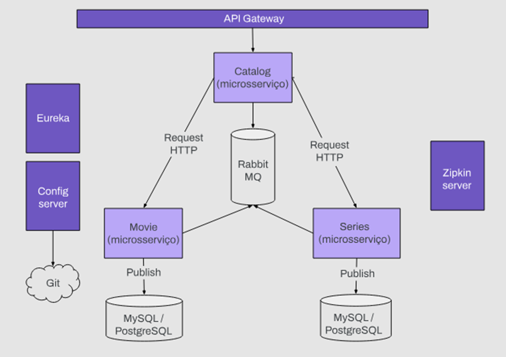

# Avaliação Final - Especialização Backend 
Projeto desenvolvido para avaliação final do bimestre

Disciplina: Especialização I em Backend

Curso: Certified Tech Developer - Digital House

## Contextualização
O projeto consiste em 3 microsserviços: Filme, Série e Catálogo. O catálogo é um microsserviço que lê informações de Filmes e Séries a fim de enviar um catálogo ao cliente. O catálogo recebe uma mensagem toda vez que um filme ou uma série são lançados e os persiste em um banco de dados MongoDB não-relacional. Quando recebe uma solicitação do cliente, ele pesquisa o banco de dados e responde.

> Projeto desenvolvido utilizando a linguagem Java e o Framework Spring. Consiste em uma aplicação de microserviços utilizando o Spring Cloud.

## Estrutura

Utilizando o Spring Cloud, implementar a seguinte arquitetura de microserviços:

## Estrutura

- Três microsserviços: filme, serie e catalogo
- O catalogo deve consumir dados de filme e serie utilizando Feign que por sua vez consome dados de um banco de dados
- O Gateway fará o roteamento para ambos os microsserviços
- O ConfigServer obtem as configurações a partir deste repositório git
- O Eureka para service discovery & service registry
- Login realizado por meio da API do Google

## Endpoints `Gateway`

- `POST`  - `http://localhost:8080/movies` para cadastro de filme
- `POST`  - `http://localhost:8080/series` para cadastro de series

- `GET`   - `http://localhost:8080/movies/{genre}` para trazer filmes por gênero
- `GET`   - `http://localhost:8080/series/{genre}` para trazer series por gênero

- `GET`   - `http://localhost:8080/catalog/{genre}` retorna o catalogo de filmes por gênero.